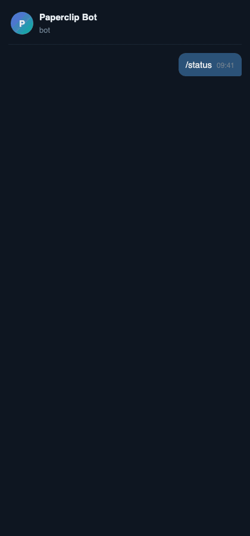

# paperclip-telegram

**Approve, reject and answer your [Paperclip](https://github.com/paperclipai/paperclip) agents from Telegram — with buttons.**

Your agents stop and ask: *"Can I merge this PR?"*, *"Which pricing model?"*, *"Deploy to production?"*
Instead of opening the board, you get the card on your phone and tap the answer. The answer is written back to Paperclip and the agent continues.

<p align="center"></p>

- ✅ **Confirmation cards** → *Approve / Reject* buttons (your agent's own labels)
- ❓ **Question forms** → one message per question, one button per option; answers are sent together when the form is complete
- 🟢 **`/status`** → running agents and everything waiting for you, re-sent with fresh buttons
- ⚠️ **Failed agent runs** → a short alert (routine self-healing errors are ignored)
- 🔕 **Done issues** → optional, silent notification
- 🔒 **Single allowed chat**, no inbound port (long polling), **no model tokens** — it only talks to the Paperclip API and the Telegram Bot API
- 📦 **Zero dependencies** — one Node.js process (≥ 20)

## Quick start (5 minutes)

1. **Create a bot**: message [@BotFather](https://t.me/BotFather) → `/newbot` → copy the token.
2. **Get a Paperclip board token** for the account that answers cards (the one you use on the board).
3. **Configure**:
   ```bash
   git clone https://github.com/iosayin/paperclip-telegram && cd paperclip-telegram
   cp .env.example .env    # fill TELEGRAM_BOT_TOKEN, PAPERCLIP_URL, PAPERCLIP_TOKEN
   node src/index.mjs --check
   ```
4. **Find your chat id**: run `node src/index.mjs`, send `/start` to your bot. It replies with your chat id. Put it in `.env` as `TELEGRAM_CHAT_ID` and restart.
5. **Run it as a service**: see [`examples/`](examples) for systemd, launchd and Docker.

From now on, every new approval or question card appears in Telegram.

## Commands

| Command | What it does |
|---|---|
| `/status` | Running agents + pending cards (with buttons) |
| `/backlog` | Cards that were already pending before the bot started, 3 at a time |
| `/help` | Help |

## Configuration

All settings are environment variables (or a `.env` file). Secrets can also be read from files: `TELEGRAM_BOT_TOKEN_FILE`, `PAPERCLIP_TOKEN_FILE`.

| Variable | Default | |
|---|---|---|
| `TELEGRAM_BOT_TOKEN` | — | required |
| `TELEGRAM_CHAT_ID` | — | the only chat the bot listens to |
| `PAPERCLIP_URL` | `http://localhost:3100` | |
| `PAPERCLIP_TOKEN` | — | required, board API token |
| `PT_LANG` | `en` | `en`, `tr` |
| `PT_POLL_SECONDS` | `60` | how often new cards are checked (min 15) |
| `PT_NOTIFY_FAILED_RUNS` | `true` | |
| `PT_NOTIFY_DONE` | `false` | silent message when an issue is done |
| `PT_IGNORE_RUN_ERRORS` | `process_lost,issue_reassigned,cancelled` | run error codes not worth an alert |
| `PT_BACKLOG_TITLE_PREFIXES` | — | issues whose title starts with these are only sent via `/backlog` |
| `PT_STATE_FILE` | `~/.paperclip-telegram/state.json` | written with mode 0600 |

## Security

- The bot **only** processes messages and button presses from `TELEGRAM_CHAT_ID`. Anything else is ignored.
- It opens **no port**: it polls Telegram. Your Paperclip server can stay on localhost or a private network (e.g. Tailscale).
- The board token can approve and answer cards on your behalf — treat it like a password. Prefer `PAPERCLIP_TOKEN_FILE` with `chmod 600`.
- Card contents are sent to Telegram. Don't use it if your agents' questions contain data that must not leave your network.

## How it works

Every `PT_POLL_SECONDS` the bot lists pending interactions on open issues (`GET /api/issues/:id/interactions`). New ones are sent with inline keyboards. A button press calls `accept`, `reject` or `respond` on the same interaction. Multi-question forms are collected locally and submitted in one call, because Paperclip closes a form on its first response.

## See also

[paperclip-watchdog](https://github.com/iosayin/paperclip-watchdog): finds stuck agent tasks and unsticks them (answered cards, finished dependencies, CI, broken sessions). Pair it with this bot: the watchdog keeps work moving, this bot brings the real questions to your phone.

## License

MIT
